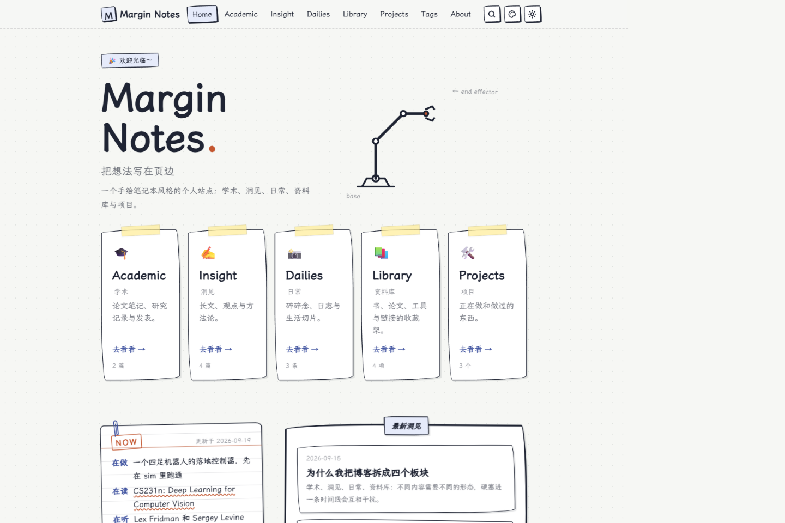

# Margin Notes · 页边笔记

一个手绘笔记本风格的 Astro 个人网站主题。用纸张、便利贴、页边批注和一条会跟随鼠标的机械臂，收纳研究、想法与日常。

**[在线演示](https://slackkai.github.io/astro-margin-notes/) · [内容管理后台](https://slackkai.github.io/astro-margin-notes/admin/) · [更新网站指南](docs/CONTENT-EDITING.md)**



## 使用主题

点击 GitHub 的 **Use this template → Create a new repository**，在自己的账号下创建仓库。也可以通过 Astro CLI 使用：

```sh
npm create astro@latest -- --template slackkai/astro-margin-notes
```

要求 Node.js ≥ 22.12，推荐 Node.js 24。

```sh
npm ci
npm run dev
```

打开终端显示的本地地址。附带文章都是主题示例，请在成为个人网站前替换成自己的内容。

## 包含什么

- **Academic**：论文笔记、研究记录、发表列表、BibTeX。
- **Insight**：长文、置顶、封面与合集导航。
- **Dailies**：时间线、图片、日常热力图。
- **Library**：书 / 课程 / 工具等收藏，可筛选、搜索、排序。
- **Projects**：项目状态、技术栈、链接、图片或视频封面。
- Markdown / MDX、KaTeX 数学公式、代码高亮、页边批注、荧光笔，后台工具栏可直接插入批注、高亮与公式。
- 深浅色与四套配色、响应式菜单、目录、阅读进度、相关文章。
- Pagefind 静态全文搜索、五个板块的标签 / 归档 / 全文 RSS、sitemap。
- Sveltia 可视化后台：文章、图片、站点信息、Now 卡片和整个关于页；列表按日期排序、草稿筛选，上传图片自动压缩为 WebP。
- GitHub Actions 自动检查并部署到 GitHub Pages，兼容根域名与仓库子路径。

## 日常更新：打开后台即可

访问自己网站的 `/admin/`，首次连接 GitHub token 后，选板块、编辑正文、上传图片、保存。内容存入仓库，GitHub Actions 自动发布。

新文章默认是草稿。发布时关闭“草稿”开关，再保存。草稿不出现在网站上，但公开仓库的源文件仍然公开。

本地也能使用后台：启动 `npm run dev`，在 Chrome / Edge 的 `/admin/` 选择 **Work with Local Repository**，选择项目根目录。编辑后通过 GitHub Desktop 或 Git 提交推送。

详细步骤、权限设置、MDX 边界和协作方式见 [可视化更新指南](docs/CONTENT-EDITING.md)。在线演示后台只能由仓库维护者编辑；使用模板创建自己的仓库后，部署会自动指向你自己的仓库。

## 配置入口

| 内容 | 位置 |
| --- | --- |
| 站名、作者、简介、联系链接、页脚结束语 | 后台“站点设置”，或 `src/data/site.json` |
| 板块开关、功能、默认配色、机械臂、研究方向 | `src/config.ts` |
| 日常文章 | 后台五个板块，或 `src/content/<板块>/` |
| 最近在做 / 在读 / 在听 | 后台“最近在做”，或 `src/content/now/now.md` |
| 关于页：自我介绍、“这个站点有什么”、工作台 | 后台“站点设置 → 关于页”，或 `src/content/about/about.md` |
| 关于页版式 | `src/pages/about.astro` |
| 字体、颜色和样式 | `src/styles/global.css` |
| 后台字段、列表排序与筛选、上传压缩 | `cms.config.mjs` |
| 后台编辑器组件（批注 / 高亮 / 公式）与预览样式 | `public/admin/components.js`、`public/admin/preview.css` |
| `:note[]` / `:mark[]` 的渲染 | `src/utils/remark-notes.mjs` |
| 内容校验规则 | `src/content.config.ts` |

默认站点文案为中文。`src/i18n/` 提供部分界面的中英文字典，完整页面语言定制还需要编辑页面文案与板块描述。

禁用板块会移除其导航、首页入口、文章、RSS 与标签；板块索引页保留为空页面并标记 noindex。若需彻底移除，可再删除对应 `src/pages/<板块>/`。

## 部署到 GitHub Pages

1. 创建自己的仓库，并将代码推送到 `main`。
2. 仓库 **Settings → Pages → Build and deployment → Source** 选择 **GitHub Actions**。
3. 在 **Actions → Deploy to GitHub Pages → Run workflow** 运行首次部署。以后推送到 `main`（包括后台保存）自动部署。

工作流从 GitHub Pages 自动获取站点域名和仓库路径，同时生成后台的目标仓库配置。通常无需手动修改 `astro.config.mjs`。

`username.github.io` 仓库使用根路径；普通仓库使用 `/仓库名/`。设置自定义域名时，按 [GitHub 官方文档](https://docs.github.com/en/pages/configuring-a-custom-domain-for-your-github-pages-site) 配置 DNS 与仓库 Pages 自定义域名，然后重新部署。站点基本信息中的 `url` 用于本地或非 GitHub 构建；Pages 工作流以实际 Pages 配置为准。

本地模拟仓库子路径（PowerShell）：

```powershell
$env:SITE_URL = 'https://your-name.github.io'
$env:BASE_PATH = '/your-repo'
npm run build
npm run verify
npm run preview
```

普通站内链接和 Markdown 图片会自动补部署前缀；新写 Astro 组件时，使用 `src/utils/url.ts` 的 `withBase('/path/')`。外部链接、锚点和相对链接不会被改写。

## 写作功能

新建 Markdown：

```sh
npm run new -- insight my-first-post "我的第一篇文章"
```

在 `src/content/insight/my-first-post.md` 中写正文，frontmatter 示例：

```yaml
---
title: 我的第一篇文章
date: 2026-09-19
description: 一句话摘要
tags: [writing]
draft: true
---
```

系列文章在 Academic / Insight 中添加：

```yaml
series:
  name: 我的研究笔记
  order: 1
```

页边批注与高亮是普通 Markdown，后台工具栏有对应按钮，富文本与 Markdown 模式可无损切换：

```md
正文中的 :mark[一个重点]。:note[这里是一条页边批注，支持 **加粗**、链接和 $d_k$ 公式。]
```

MDX 文件里也可以继续使用 `<Mark>` / `<Note>` 组件，渲染结果相同。

`/drafts/` 和 `/lab/` 仅本地开发可见。公开搜索只索引已发布内容详情页，避免列表与标签页重复命中。

## 常用命令

| 命令 | 用途 |
| --- | --- |
| `npm run dev` | 启动写作预览，显示草稿并生成后台资源 |
| `npm run build` | 构建静态网站、后台与 Pagefind 索引 |
| `npm run preview` | 预览生产构建，验证真实搜索 |
| `npm run preview -- stop` | 停止 Astro 的后台预览服务 |
| `npm run check` | 类型和 Astro 检查 |
| `npm test` | 轻量回归测试 |
| `npm run test:production` | 真实构建回归，验证草稿和配置开关；结束后重新构建 |
| `npm run verify` | 检查构建后的站内链接、资源、锚点和部署产物 |

开发时搜索索引不会实时更新。需要验证搜索时运行 `npm run build` 后使用 `npm run preview`；`npm run search:dev` 可以把一次构建的搜索索引复制到开发服务器，但它会随内容编辑过期。

## 留言与许可

留言通过 Web3Forms 发送邮件。将自己的公开 access key 填入 `src/config.ts` 的 `guestbook.web3formsKey`；留空时提交按钮禁用。演示不接收邮件。

主题采用 [MIT](LICENSE)。字体为 [霞鹜文楷 Screen](https://github.com/lxgw/LxgwWenKai-Screen)，使用其 OFL 许可；[Sveltia CMS](https://github.com/sveltia/sveltia-cms) 的 MIT 许可随后台资源一同分发。第三方依赖保留各自许可证。

修复清单、验收方式与已知边界见 [检查报告](docs/REVIEW.md)。
